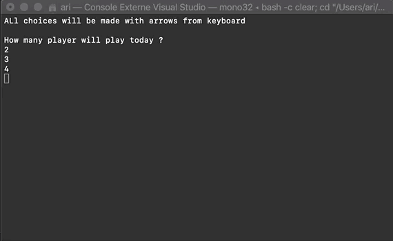

Leeroy BITBOL
Ariane HUCKEL
IBO1

# MONOPOLY GAME

The project's goal was to produce a simplified version of the Monopoly game.
We can play from 2 to 4 players and the game is finished when everybody except the winner, has a negative cash balance. Players can buy properties (streets) all around the board, and other people will pay when they land on them. Prices can grow if a player has bought all of the properties from a certain neighborhood, defined by a color.

To implement the game in C#, we used different design patterns.

## DESIGN PATTERNS USED

 * ### MVC

We used the Model-View-Controller design pattern with the class Board, GameView and GameController. Therefore, the user interacts with the controller, in order to, for example *start the game*, when he can chose how many players from 2 to 4 will play and give them names. It accepts the input and then interacts with the Board so now the program saves the information. With the MVC, we can separate the way the program knows the informations and how they are presented to the user. The class GameView is supposed to share any representation of the game to the user, but as it wasn't a good way to represent it, we preferred to use Unity, as we will talk about it later. In the controller, the user can also chose what his next action will be, such as showing the balance and position of each player. 
To be updated whenever there is a change in a player’s balance, we used another design pattern : the observer.

* ### Observer

The Subject will affect the interface PlayerObserver whenever there is any change in the user’s balance. Thus, in the Player class that inherits from the PlayerObserver interface, we can see that the Update method will write the new balance after notification, made by the subject. This simplifies the event management, when one class triggers the execution of the balance change.

* ### Factory

Finally, for more readable project we used the Factory method design pattern for the different cases in the game. The ActionCase and CityCase classes directly inherits from the Case abstract class.  This allowed the construction of classes such as the two derived Case classes, with a component of a type that has not been predetermined, but only defined by a name. The case can be City or Action but no concrete type of Case has been decided firstly.
Thus, for example, a CityCase instance which has much more attributes than an ActionCase one, could be treated in a certain way when called in LandOnAction method for example.

## WHAT DOES IT LOOK LIKE

### UNITY
        
To make it more pleasant (and also more understandable!) to play, we implemented this code in Unity. This is what starting the game looks like :

When a player lands on another player's proprety, the cash is immediately withdrawn.
On the other hand, when a player's balance is too low, the game informs him that he cannot buy the property, whereas if he lands on his own property, the game will simply tell him this is his' just in case.

And when someone lands on Parc Gratuit, he gets all of the accumulated money from taxes.

## Let's try the real game now ;)

